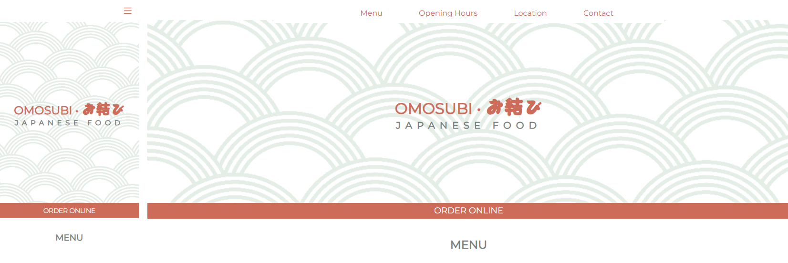
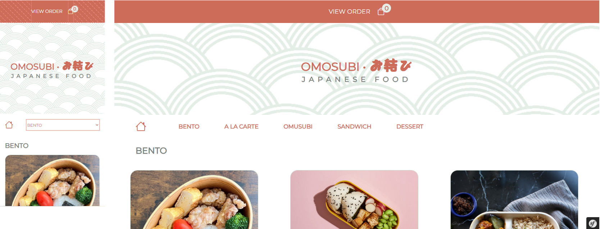

# Restaurant Landing Page

This web development project is an online platform for restaurants, enabling customers  to explore the menu and place orders while administrators have access to a dashboard for managing menu categories and items. With a responsive design, this solution is scalable and aims to facilitate restaurants operations.


## Core Features

- Menu Management
- Menu Display
- Order Online Page


## Screenshots

Home 


Online Order 



## Tips

If you import my sql file 'restaurant' located in the 00_readme folder

- You can go to yourlocalhost/login
- And use admin@admin.com / adminadmin
- Create menu informations in this order : new menu category, new menu item


## Code tricks

In the Online Order template, I couldn't display the property 'stock_quantity' by calling it directly. This didn't work :


```html
<p>Stock : {{ one_item.stock_quantity }} </p>

```


If you encounter the same kind of issue, try to replace the property by its function instead.

```html
<p>Stock : {{ one_item.getStockQuantity() }} </p>

```


## Future Improvements

- Menu Filters
- Order Online Management
- User Account


## 🍞 About Me
Hi everyone, I'm Madame R. a Web Developer from France. 
Currently in training, I'm a database enthusiast.
Enjoy your stay, have a look at my other repositories and let's get in touch if you wish to work with me.

## Tech Stack

**Database:** MySQL Workbench, Doctrine

**Back End:** Symfony, WAMP (Windows, Apache, MySQL, PHP) or XAMPP (Cross-Platform, Apache, MySQL, PHP, and Perl)

**Front End:** HTML, CSS, Javascript, Bootstrap

**IDE:** Visual Studio Code


## Acknowledgements

Back End
 - [Dustin Dobervich for Vich Uploader](https://github.com/dustin10/VichUploaderBundle)

 Front End
 - [Starline for the wave pattern ](https://fr.freepik.com/auteur/starline)


## License


